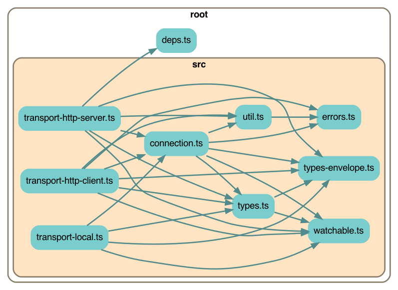
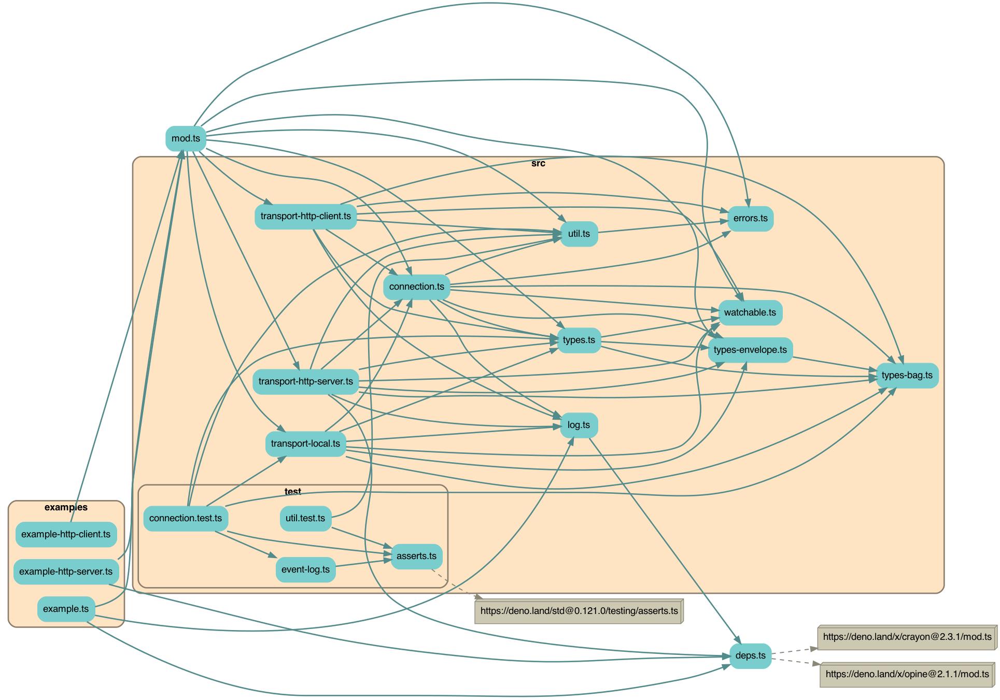

# Earthstar Streaming RPC

Similar to JSON-RPC, but also supports streaming (soon). Written to be used in
Earthstar ([github](https://github.com/earthstar-project),
[docs](https://earthstar-website.fly.dev/)).

<!-- START doctoc generated TOC please keep comment here to allow auto update -->
<!-- DON'T EDIT THIS SECTION, INSTEAD RE-RUN doctoc TO UPDATE -->
**Table of Contents**

- [Usage](#usage)
  - [Importing](#importing)
  - [Concepts](#concepts)
  - [API Example](#api-example)
  - [Closing things](#closing-things)
  - [Error handling](#error-handling)
  - [Transport classes](#transport-classes)
    - [HTTP](#http)
    - [Other](#other)
    - [Future transport types, not written yet](#future-transport-types-not-written-yet)
  - [Writing a new kind of Transport class](#writing-a-new-kind-of-transport-class)
- [Packaging & Building](#packaging--building)
  - [Code structure](#code-structure)
  - [Development](#development)
    - [Setup](#setup)
    - [Scripts](#scripts)
    - [Where to find things](#where-to-find-things)
    - [Publishing to NPM](#publishing-to-npm)

<!-- END doctoc generated TOC please keep comment here to allow auto update -->

## Usage

### Importing

To use in Deno:

```ts
import {
    TransportHttpClient,
    TransportHttpServer,
} from "https://TODO.com/earthstar-streaming-rpc/mod.ts";
```

To use with Node or apps built with NPM dependencies:

`npm install earthstar-streaming-rpc`

And then import in your code:

```ts
import {
    TransportHttpClient,
    TransportHttpServer,
} from "earthstar-streaming-rpc";
```

### Concepts

A **Transport** represents a certain kind of network connection.  It's responsible for managing **Connections** with other devices.  There are many flavors of Transport class, but only one kind of Connection class.  A Transport can represent a client-server sort of network connection like HTTP, or a symmetrical p2p one like hyperswarm.

A **Connection** instance is a 1-to-1 relationship with another device, and gives you a way to call methods on the other device.

Connections are symmetrical, regardless of the underlying client-server nature of the network connection -- either side of the connection can call methods on each other.

### API Example

Look in [types.ts](src/types.ts) for more details.

Let's define some methods that you want to expose to other devices.  Think carefully about security with these!

You can also use a class here instead of an object-of-functions.  You can use sync or async functions.

NOTE: the arguments and return value must all be JSON-serializable.  In particular this means you can't use `undefined` anywhere -- use `null` instead.

```ts
const methods = {
    add: (a: number, b: number) => a + b,
    greetSlowly: async (name: string) => {
        await sleep(1000);
        return 'Hello ' + name;
    }
}
```

Create a Transport for the kind of network connecton you want to use.  You are responsible for coming up with a random `deviceId`.  It can be different each time your code runs, but if you have several Transports running at the same time on your device, use the same `deviceId` on each one.

```ts
// Each kind of Transport has its own unique constructor
const transport = new TransportHttpClient({
    deviceId: 'o93idjodo2i3jd',
    methods,
});
```

Create a Connection to the other device.

```ts
// Each kind of Transport has its own way of doing this.
const conn = transport.addConnection('http://example.com/api/v1');

// Server-side transports don't let you create Connections on demand --
// they sit and wait for connections to arrive.
// You can grab the existing connections from the array
// at transport.connections
```

Use the Connection to call methods on the other device.  There are 3 ways to do this:
* `notify` -- call the method but don't wait for the result
* `request` -- call the method and wait for the result to come back
* `stream` -- TODO: start a stream (not implemented yet)

```ts
// This does not return an answer.
await conn.notify('greetSlowly', 'Suzy');

// This waits for the returned value.
const three = await conn.request('add', 1, 2);
```

### Closing things

Connections have a `status` which can be CONNECTING, OPEN, ERROR, or CLOSED.  The possible sequence of states is:

```
CONNECTING --> (OPEN | ERROR)* --> CLOSED

examples
CONNECTING --> CLOSED
CONNECTING --> OPEN --> CLOSED
CONNECTING --> ERROR --> CLOSED
CONNECTING --> OPEN --> ERROR --> OPEN --> ERROR --> CLOSED
```

ERROR means the network connection failed.  It will try to reconnect and become OPEN again.

It won't become CLOSED until you ask it to; once CLOSED it can't be used anymore or re-opened (make a new one instead).

`status` is a [`Watchable`](src/watchable.ts) -- you can subscribe to changes, and you have to use `get()` to get the value.  Don't set it yourself.

```ts
// using the connection status

console.log(connection.status.get());

connection.status.onChange((oldVal, newVal) => { /* ... */ });

connection.status.onChangeTo('CLOSED', (oldVal, newVal) => { /* ... */ });

connection.close();
```

The Transport also has a `status` but it can only be OPEN or CLOSED.  

It won't become CLOSED until you ask it to; once CLOSED it can't be used anymore or re-opened (make a new one instead).

```
OPEN --> CLOSED
```

When you're done, be sure to `close` the Transport.  Otherwise it might have some timers running which will prevent Deno or Node from exiting.  Closing the Transport will close all the Connections for you.

```ts
transport.close();
```

### Error handling

If there's a network problem:
* `connection.status` will become `ERROR`
* `connection.notify` and `connection.request` will throw errors
* The Connection will try to reconnect and become `OPEN` again

If your method call is malformed (wrong number of arguments, unknown method, etc):
* `connection.notify` or `connection.request` will throw an error

If your method call crashes on the other side:
* `connection.notify` or `connection.request` will throw an error

If you try to do anything with a Connection or Transport that is CLOSED:
* an error will be thrown

### Transport classes

#### HTTP

`TransportHttpClient`

`TransportHttpServer`

This is a lazy way to get bidirectional communication over HTTP.  We'll improve it later:

Client --> server: messages are POSTed in batches (arrays), currently one at a time, so the array always has length 1.  This should be improved by batching up messages and sending them every 50 milliseconds.

Server --> client: The client does GET requests to poll for batches of messages that the server has accumulated for that particular client (by deviceId).  It polls quickly until the server is empty, then it slows down and polls every couple of seconds.  This should be converted to a single streaming GET.

The server class takes an existing Express server app in its constructor, and adds a route handler to it.  The client uses `fetch`.

#### Other

`TransportLocal` - A connection within one device, mostly useful for testing.

#### Future transport types, not written yet

* BroadcastChannel, for communicating between browser tabs
* Websockets
* Hyperswarm

### Writing a new kind of Transport class

Behind the scenes, each method call (or response) is wrapped in an Envelope object which is then (de)serialized to JSON.

TODO: write more

## Packaging & Building

This is a "Deno-first" package -- it's written for Deno, and then also converted
and published to npm. It should also work from browsers -- typically you'd
import it from your own separate npm project and use a bundler such as webpack
to put everything together.

### Code structure

Just the important things:



Everything:



### Development

#### Setup

You will need Deno installed.
[Instructions for installation can be found here](https://deno.land/#installation).
You may also want type-checking and linting from Deno for your IDE, which you
can get with extensions
[like this one for VSCode](https://deno.land/manual@v1.17.2/vscode_deno).

To check that you've got everything set up correctly:

`make example`

This will run the example script at `example-app.ts`, and you will see a lot of
colourful log messages from the app.

#### Scripts

Scripts are run with the `make` command.

- `make test` - Run all tests
- `make test-watch` - Run all tests in watch mode
- `make fmt` - Format all code in the codebase
- `make npm` - Create a NPM package in `npm` and run tests against it (requires
  Node v14 or v16 to be installed).
- `make bundle` - Create a bundled browser script at `earthstar.bundle.js`
- `make depchart` - Regenerate the dependency chart images
- `make coverage` - Generate code test coverage statistics
- `make clean` - Delete generated files

#### Where to find things

- The entry for the package can be found at `mod.ts`.
- Most external dependencies can be found in `deps.ts`. All other files import
  external dependencies from this file.
- Script definitions can be found in `Makefile`.
- Tests are all in `src/test/`
- The script for building the NPM package can be found in `scripts/build_npm.ts`

#### Publishing to NPM

1. Run `make VERSION="version.number.here" npm`, where `version.number.here` is
   the desired version number for the package.
2. `cd npm`
3. `npm publish`
