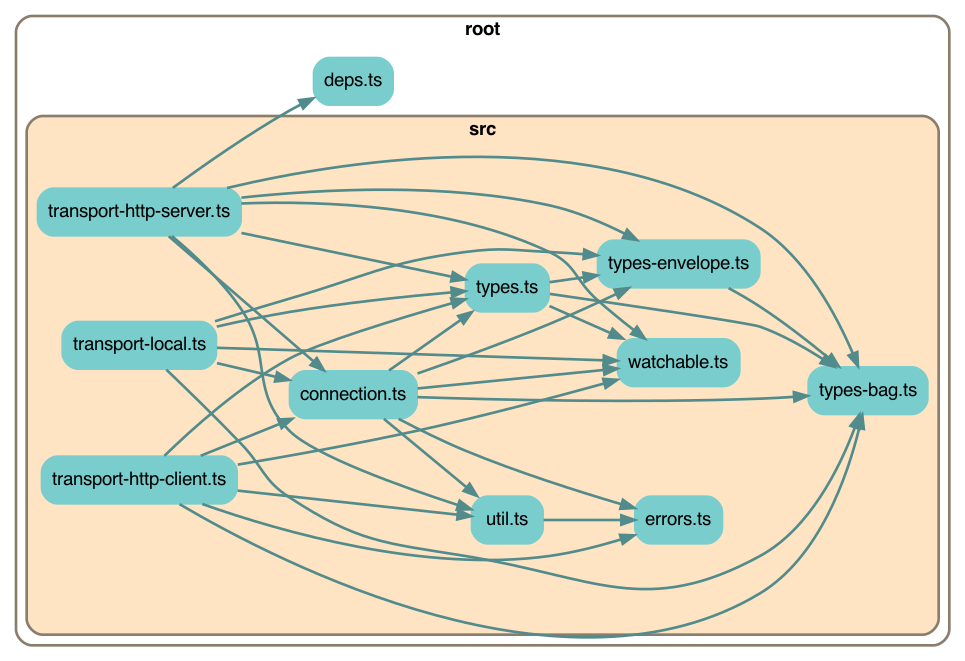

# Earthstar Streaming RPC

Very similar to JSON-RPC, but also supports streaming.  Written to be used in Earthstar ([github](https://github.com/earthstar-project), [docs](https://earthstar-website.fly.dev/)).

This is a "Deno-first" package -- it's written for Deno, and then also converted and published to npm.  It should also work from browsers -- typically you'd import it from your own separate npm project and use a bundler such as webpack to put everything together.

## Code structure

Just the `src`:



Everything:


## Usage

To use in Deno, add the following:

```ts
import * as RPC from "https://TODO.com/earthstar-streaming-rpc/mod.ts";
```

To use with Node or apps built with NPM dependencies:

`npm i earthstar-streaming-rpc`

And then import in your code:

```ts
import * as RPC from "earthstar-streaming-rpc";
```

## Development

### Setup

You will need Deno installed. [Instructions for installation can be found here](https://deno.land/#installation). You may also want type-checking and linting from Deno for your IDE, which you can get with extensions [like this one for VSCode](https://deno.land/manual@v1.17.2/vscode_deno).

To check that you've got everything set up correctly:

`make example`

This will run the example script at `example-app.ts`, and you will see a lot of colourful log messages from the app.

### Scripts

Scripts are run with the `make` command.

- `make test` - Run all tests
- `make test-watch` - Run all tests in watch mode
- `make fmt` - Format all code in the codebase
- `make npm` - Create a NPM package in `npm` and run tests against it (requires Node v14 or v16 to be installed).
- `make bundle` - Create a bundled browser script at `earthstar.bundle.js`
- `make depchart` - Regenerate the dependency chart images
- `make coverage` - Generate code test coverage statistics
- `make clean` - Delete generated files

### Orientation

- The entry for the package can be found at `mod.ts`.
- Most external dependencies can be found in `deps.ts`. All other files import external dependencies from this file.
- Script definitions can be found in `Makefile`.
- Tests are all in `src/test/`
- The script for building the NPM package can be found in `scripts/build_npm.ts`

### Publishing to NPM

1. Run `make VERSION="version.number.here" npm`, where `version.number.here` is the desired version number for the package.
2. `cd npm`
3. `npm publish`
